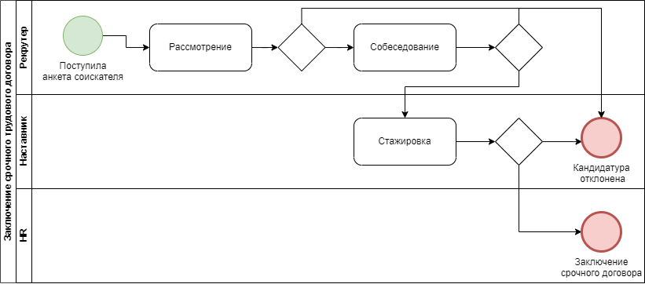
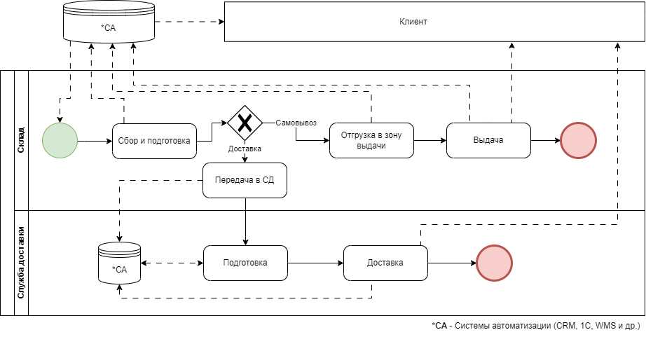
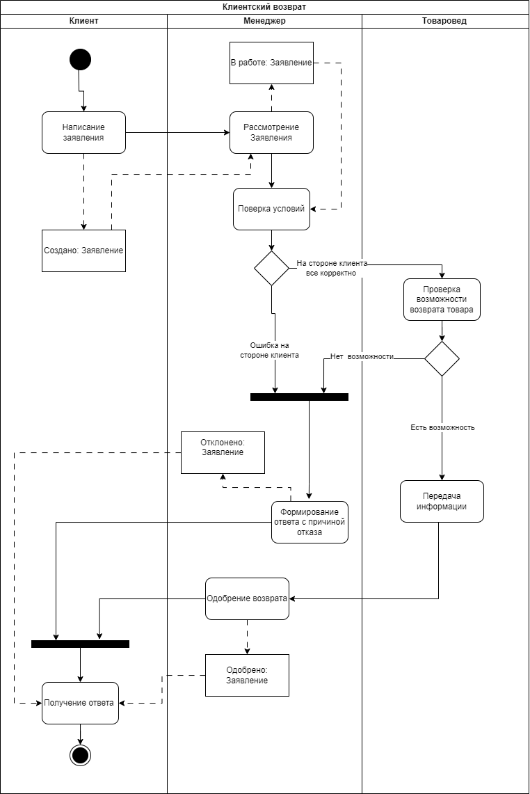

# Основы моделирования бизнес-процессов
## Семинар 1. Введение в операционную модель.

### Задание 1. Отличия бизнес-модели от операционной:

Бизнес-модель отвечает на вопрос: «Что мы делаем и для кого?».
Бизнес-модель описывает, как компания создает, предоставляет и зарабатывает деньги. Это своего рода "план" того, как бизнес будет функционировать и каким образом он будет достигать прибыли. Бизнес-модель определяет ценность, которую компания предоставляет клиентам, и как она извлекает деньги за эту ценность.

Операционная модель отвечает на вопрос: «Как мы это делаем?».
Операционная модель концентрируется на том, как компания организовывает свои внутренние процессы и ресурсы для достижения целей, заданных бизнес-моделью. Это связано с тем, как бизнес производит товары или предоставляет услуги, управляет поставками, управляет персоналом, контролирует качество и так далее.

Таким образом, основные различия между бизнес-моделью и операционной моделью заключаются в том, что бизнес-модель описывает общий план заработка денег, в то время как операционная модель определяет, каким образом компания организует свои внутренние процессы для реализации этого плана.

### Задание 2.  На мой взгляд все элементы операционной модели важны так как все они взаимосвязаны и влияют на успех компании на долгосрочной основе. 

Я в свою очередь на свой взгляд постарался выстроить их в порядке значимости:
1.	Непрерывное совершенствование: этот элемент занимает первое место, так как постоянное улучшение процессов, продукции и услуг обеспечивает долгосрочную конкурентоспособность компании и способность адаптироваться к изменяющимся рыночным условиям.

2.	Процессная модель: эффективные процессы являются основой операционной деятельности. Оптимизированные и хорошо организованные процессы позволяют компании эффективно выполнять задачи и управлять ресурсами.

3.	Внутренние контроли: эффективная система внутренних контролей помогает обеспечивать надежность операций, предотвращать ошибки и мошенничество, а также поддерживать соответствие стандартам и регуляторным требованиям.

4.	ИТ-инфраструктура: современные информационные технологии существенно влияют на эффективность операций. Они поддерживают автоматизацию, аналитику и улучшение коммуникации внутри компании.

5.	Персонал: Компетентные и мотивированные сотрудники играют важную роль в успехе компании. Однако, без оптимизированных процессов и хорошей организационной структуры, даже высококвалифицированные сотрудники могут столкнуться с трудностями.

6.	Организационная структура: хорошо организованная структура способствует определению ролей и ответственности, что важно для эффективной координации действий внутри компании.

7.	Сервисная модель: для компаний, ориентированных на услуги, эта модель становится важной. Однако она зависит от оптимизированных процессов и персонала, чтобы успешно предоставлять услуги клиентам.

8.	Методология / нормативная база: хотя это важный аспект для обеспечения последовательности и качества деятельности, он часто зависит от эффективных процессов.

Дополнительно хотелось бы уточнить то, что в зависимости от сферы деятельности приоритет может меняться.

## Семинар 2. Введение в бизнес-процессы.
### Задание 1. Для сравнения возьмем 2 компании из сферы ритейла строительных материалов компанию "Леруа Мерлен" и "ХозДом"

Основные отличия бизнес процессов:  

Леруа Мерлен - это крупная международная компания, специализирующаяся на продаже строительных материалов, товаров для дома и сада. Они имеют широкий ассортимент товаров, включая стройматериалы, инструменты, мебель, отделочные материалы, электротехнику и многое другое. 

ХозДом - это локальная компания имеющая несколько магазинов в одном городе, специализирующая на продаже товаров хоз. назначения, товаров для ремонта и строительства.
 
Основное отличие Леруа Мерлен от  магазина ХозДом заключается в масштабе и разнообразии предлагаемых товаров. Леруа Мерлен имеет большой выбор товаров, а также может предлагать услуги по доставке, установке и консультации. Они также часто имеют свои собственные бренды и продукты. 

ХозДом, с другой стороны, более ориентирован на конкретные потребности местности. Они могут предлагают более узкий ассортимент товаров, но в то же время обладать большими знаниями и опытом в конкретной области.

 
Кроме того, Леруа Мерлен как крупная компания может иметь более развитую систему управления бизнес-процессами, включая логистику, управление запасами и информационные технологии. Они также могут иметь более широкие возможности для маркетинга и рекламы, что позволяет им привлекать больше клиентов и развиваться на рынке. 

ХозДом может существовать без собственной службы безопасности, существование Леруа Мерлен тяжело представить без СБ.

Так же к отличиям можно отнести наличие интернет магазина, сайта и службы поддержки.

В целом, отличия между Леруа Мерлен и локальным магазином строительных материалов связаны с масштабом, разнообразием товаров, специализацией и доступностью.

### Задание 2. Основные и вспомогательные процессы компаний: 
Leroy Merlin: 

1. Процесс продаж: Включает деятельность, связанную с продажей товаров клиентам, такую как генерация потенциальных клиентов, предоставление информации о товарах, помощь покупателям и обработка заказов. 
2. Процесс закупок: Леруа Мерлен управляет процессом поиска и закупки товаров у поставщиков, включая переговоры по контрактам и обеспечение своевременной доставки товаров. 
3. Процесс управления запасами: Включает деятельность, связанную с управлением уровнями запасов, отслеживанием движения товаров на складе и применением эффективных методов хранения и пополнения запасов. 
4. Процесс маркетинга: Леруа Мерлен разрабатывает маркетинговые стратегии, проводит маркетинговые исследования, рекламные кампании и акции для привлечения клиентов и увеличения объема продаж. 
5. Процесс управления магазином: Включает общее управление магазином, , оптимизацию размещения товаров, обеспечение качественного обслуживания клиентов и обеспечение плавного повседневного функционирования. 
6. Процесс управления персоналом: Включает деятельность, такую как найм, обучение, управление производительностью и развитие сотрудников, чтобы обеспечить наличие квалифицированной и мотивированной рабочей силы. 
7. Финансовый управленческий процесс: Леруа Мерлен управляет финансовыми операциями, такими как бюджетирование, учет, финансовая отчетность и управление денежными потоками, чтобы обеспечить правильный финансовый контроль и принятие решений. 
8. Процесс управления информационными технологиями: Включает управление ИТ-инфраструктурой, системами и программными приложениями для поддержки различных бизнес-функций, управления данными и технологических решений. 
9. Процесс управления объектами: Леруа Мерлен занимается управлением объектами, включая обслуживание, безопасность и обеспечение безопасной и комфортной рабочей среды для сотрудников и клиентов. 
10. Процесс обеспечения качества: Включает в себя внедрение мер контроля качества, проведение проверок и обеспечение соответствия продуктов и услуг требуемым стандартам и ожиданиям клиентов. 
11. Процесс управления рисками: Включает идентификацию и оценку потенциальных рисков, разработку стратегий по управлению рисками и внедрение мер для минимизации рисков для бизнеса. 
 
ХозДом: 
1. Процесс продаж: Включает деятельность, связанную с продажей товаров клиентам, включая представление товаров, помощь покупателям. 
2. Процесс управления поставщиками: Включает управление отношениями с поставщиками, выбор надежных поставщиков, переговоры по контрактам и обеспечение постоянного поступления качественных товаров. 
3. Процесс контроля запасов: ХозДом управляет уровнями запасов, отслеживает движение товаров на складе и применяет стратегии для оптимизации наличия товаров и минимизации нехватки товаров. 
4. Процесс маркетинга: ХозДом фокусируется на местных маркетинговых усилиях, таких как таргетированная реклама, локальные физические носители проведение акций и создание взаимоотношений с клиентами в местном сообществе. 
5. Процесс управления магазином: Включает общее управление магазином, формирование персонала, оптимизацию размещения товаров.
6. Процесс управления отношениями с поставщиками: ХозДом управляет отношениями с поставщиками, включая выбор поставщиков, переговоры и оценку их работы, чтобы обеспечить надежную цепочку поставок. 
7. Финансовый управленческий процесс: ХозДом занимается финансовыми операциями, такими как бюджетирование, управление расходами и финансовый анализ, чтобы обеспечить финансовую стабильность и прибыльность. 
8. Процесс управления ИТ-инфраструктурой: Включает управление ИТ-инфраструктурой, сетями и программными приложениями для поддержки бизнес-операций. 
9. Процесс обслуживания объектов: ХозДом занимается обслуживанием и поддержкой физических объектов, включая ремонт, реконструкцию и обеспечение безопасной и комфортной среды для сотрудников и клиентов. 

## Семинар 3. Декомпозиция процессов.
### Задание 1. Декомпозировать любой бизнес процесс до второго уровня.

|Уровень|Бизнес процесс|||
|-|-|-|-|
|0|**Управления персоналом**|...||
|1|**Найм**|...|||
|2|**Отбор**|**Стажировка**|**Испытательный срок**|

## Семинар 4. Описание бизнес-процессов.
### Задание 1. Опишите процесс «Оформление договора» в таблице и с помощью графического способа.
**"Заключение срочного договора"**  

*Таблица*
|№|Название|Инициатор|Ответственный|Срок|Положительный итог|Отрицательный итог|
|-|-|-|-|-|-|-|
|1|Рассмотрение анкеты|Соискатель|Рекрутер|1 раб. день|Приглашение кандидата на собеседование|Отклонение кандидатуры|
|2|Собеседование|Рекрутер|Рекрутер|1 час|Приглашение на стажировку|Отклонение кандидатуры|
|3|Стажировка|Рекрутер|Наставник|7 раб.дней|Найм сотрудника на испытательный срок|Отклонение кандидатуры|
|4|Заключение срочного договора|Наставник|HR|1 час|Подписание документов|Отказ со стороны кандидата|

*Блок-схема*

## Семинар 5. Нотации описания бизнес-процессов BPMN.
### Задание 1. Отрисовать любой процесс в нотации BPMN.

## Семинар 6. Нотации описания бизнес-процессов UML.
### Задание 1. Отрисовать любой процесс в нотации UML.
